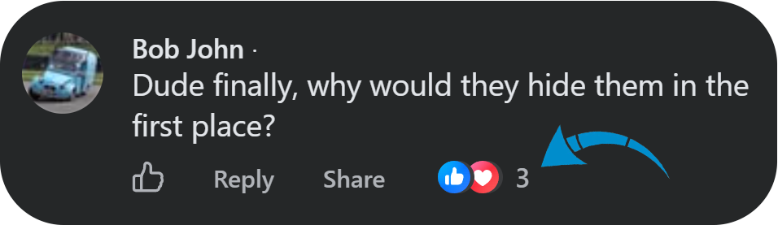
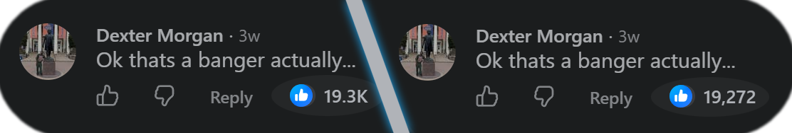
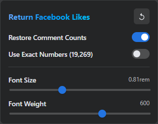

#  _Return Facebook Likes_

  
    

## About

Came here because of the Facebook's recent update that hides reaction counts behind a hover? **Return Facebook Likes** is a lightweight browser extension that restores just that!

Simple, fully local, requires zero API permissions, and has zero tracking, zero telemetry, and no dependencies.

  

## Key Features

- Restores reaction counts on post comments.
- Shows total reactions on posts even if the author has chosen to hide the public reaction count.
- Appends numbers inside the native button layout, keeping the click target active so you can still click the count to see _who_ reacted.
- Extracts reaction counts directly from Facebook's internal React Fiber tree.
- It _should_ work out of the box in multiple languages as it relies on structural GraphQL data rather than translated labels.
- You can choose between _rounded_ or _exact_ reaction counts:

  

  

## Permissions & Privacy

This extension uses the `storage` permission to save the extension settings. It requires no tracking or sensitive background permissions.  
While the browser might also display a warning saying the extension can _"Read and change your data on facebook.com"_, this is strictly because the extension must be able to insert the numbers into Facebook's page source.

## Installation

### Option 1: Chrome Web Store

The easiest way to use the extension:

1. Visit the [Chrome Web Store page](https://chromewebstore.google.com/detail/difgdoobfmnpndnikcghgbkbnhdnmoim).
2. Click **Add to Chrome**.

### Option 2: Manual Installation (Developer Mode)

If you want to run the extension directly from the source code:

1. Clone this repository or download the ZIP from [GitHub Releases](https://github.com/S4adam/return-facebook-likes/releases).
2. Extract the ZIP file on your computer.
3. Open Chrome and navigate to `chrome://extensions/`.
4. Enable **Developer mode** (toggle in the upper right corner).
5. Click **Load unpacked** in the upper left corner.
6. Select the extracted folder.

## License

This project is licensed under the GNU General Public License v2.0.
